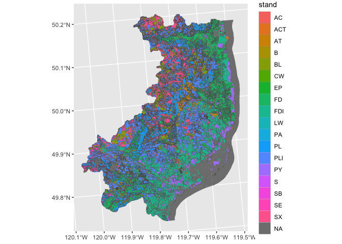
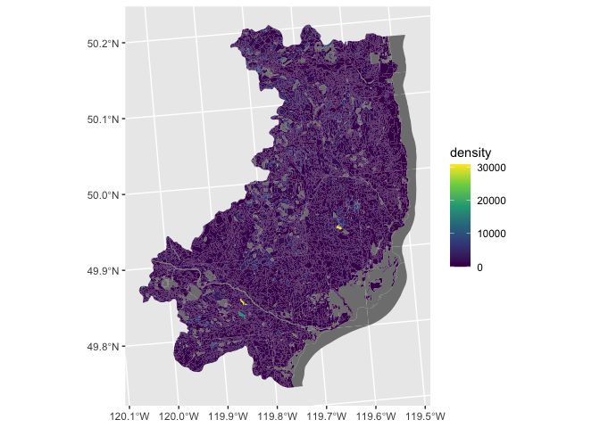
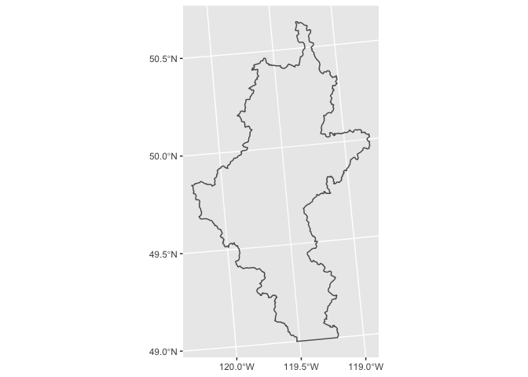
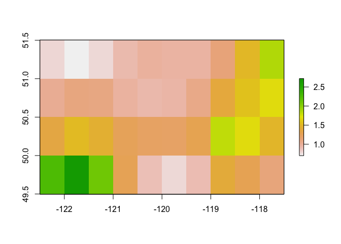
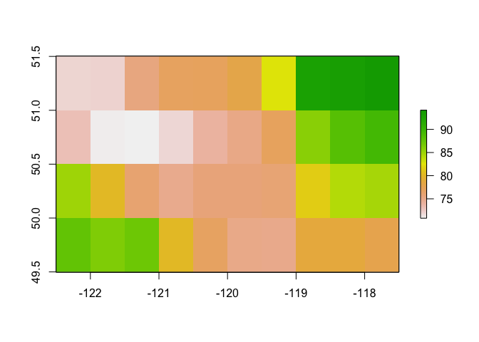
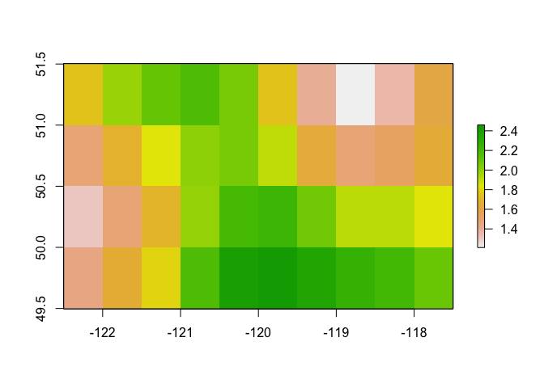
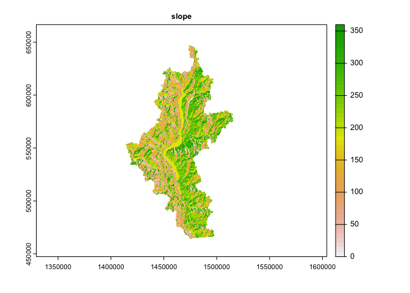

Proof of Concept: Fuel Mapping CFFDRSv2.0 Prototype
================
CabinGIS
24/02/2022

-   [Action](#action)
-   [1 Stand-Adjusted CFFDRS Fuel Typing
    Model](#stand-adjusted-cffdrs-fuel-typing-model)
-   [2 BC WildFire Fuel Typing VRI-Layer
    Algorithm](#bc-wildfire-fuel-typing-vri-layer-algorithm)

## Action

Running with some of the momentum from meeting 24th Feb, the following
was drafted as a quick and dirty pipeline prototype to produce two
mapping deliverables described in the NRC grant “High-Resolution
Mapping”:

-   NRC Grant: <https://www.ic.gc.ca/eic/site/101.nsf/eng/00157.html>

We’ve since found some relevant R-tools that were developed by NRC in
the new [cffdrs
R-package](https://cran.r-project.org/web/packages/cffdrs/cffdrs.pdf)
specifically for generating the two main components of the Canadian
Forest Fire Danger Rating System: the Fire Weather Index and the Fire
Prediction Behaviour Model. These include algorithms to measure three
forest fuels classes and their moisture content indices: Fine Fuel
Moisture Code (FFMC), Duff Moisture Code (DMC), Drought Code (DC). FFMC
and DMC make up two of the five predictors needed to run the Wotton and
Beverly’s stand-adjusted fuel-typing model (Wotton and Beverly (2007)).
Need a second opinion here as it doesn’t seem 100% clear if NRC are
interested in vegetation mapping outputs that are focused solely on fuel
typing without the moisture codes and climate variables, or they want
something that includes the FFMC and DMC.

If its the former, there is some useful info found in the cffdrs package
that describe the data requirements of the FWI System There is also a
FWI test dataset ‘test_fwi’ showing the format of these inputs that is
presented below. In the pilot test below, we generated the five raster
predictors that are required inputs in the Wotton standjust CFFDRS
model. These rasters were derived for the Peachland watershed area for
the 2021 fire season period up until June 30th of that year.

``` r
library(cffdrs)
print(as_tibble(test_fwi), n = 10)
```

    ## # A tibble: 48 × 9
    ##     long   lat    yr   mon   day  temp    rh    ws  prec
    ##    <int> <int> <int> <int> <int> <dbl> <int> <int> <dbl>
    ##  1  -100    40  1985     4    13  17      42    25   0  
    ##  2  -100    40  1985     4    14  20      21    25   2.4
    ##  3  -100    40  1985     4    15   8.5    40    17   0  
    ##  4  -100    40  1985     4    16   6.5    25     6   0  
    ##  5  -100    40  1985     4    17  13      34    24   0  
    ##  6  -100    40  1985     4    18   6      40    22   0.4
    ##  7  -100    40  1985     4    19   5.5    52     6   0  
    ##  8  -100    40  1985     4    20   8.5    46    16   0  
    ##  9  -100    40  1985     4    21   9.5    54    20   0  
    ## 10  -100    40  1985     4    22   7      93    14   9  
    ## # … with 38 more rows

However, if its the second, and they are wanting a deliverable that is
purely fuel-type focused, it may be worth having at look at and
following closely the ‘FLNRO 2015 BC Fuel-Typing and VRI-Layering
Framework’ (Perrakis, Eade, and Hicks (2018)). In it, they’ve developed
an Arc-Python based algorithm that filters the VRI dataset using a kind
of multi-criteria classification key to delineate landscapes into
polygons according to the 16 Canadian Standard Fuel Type classes (Hirsch
(1996)). In the final section below, we made a rough attempt of fitting
this algorithm and coding the 100-plus VRI-criteria-layers (only got to
23) to generate similar fuel-type rasters. This report, its scripts and
its virtual environment are stored in the github repo here:
<https://github.com/seamusrobertmurphy/Wildfire-Fuel-Mapping-CFFDRS-2.0>.

# 1 Stand-Adjusted CFFDRS Fuel Typing Model

Five spatial predictor variables are needed to fit the Wotton and
Beverly stand-adjusted fuel typing model (Wotton and Beverly (2007)) :
“FFMC, DMC, stand (1:5; deciduous, Douglas-fir, mixedwood, pine,
spruce), density (1:3; light, mod, dense), season (1, 1.5, 2, 3; spring,
spr-sum transition, sum, fall). Two of these predictors, including
density and stand were extracted from VRI-layers as simpleFeatures
objects and then rasterized and stacked using the terra and raster
packages.

``` r
library(ggplot2)
watershed_bdrys = read_sf("./Data/BCGW_7113060B_1645786298548_3276/LWADM_WATMGMT_PREC_AREA_SVW/LWADM_PA_polygon.shp")
peachland = watershed_bdrys[watershed_bdrys$PRECNC_NAM == "Peachland", ]
vri_sf = read_sf("./Data/BCGW_7113060B_1645786298548_3276/VEG_COMP_LYR_R1_POLY/VEG_R1_PLY_polygon.shp")
vri_sf = st_intersection(st_make_valid(vri_sf), peachland)

stand = vri_sf["SPEC_CD_1"] %>%
  mutate(SPEC_CD_1 = as.factor(SPEC_CD_1))
stand = rename(stand, stand = SPEC_CD_1)
summary.factor(stand$stand)
```

    ##   AC  ACT   AT    B   BL   CW   EP   FD  FDI   LW   PA   PL  PLI   PY    S   SB 
    ##    1   33  496    4 1122    9  104 2255 1648   20   10 1804 1752  299   60    1 
    ##   SE   SX NA's 
    ##  214 1349  875

``` r
density = vri_sf["LIVE_STEMS"] %>%
  mutate(LIVE_STEMS = as.numeric(LIVE_STEMS))
density = rename(density, density = LIVE_STEMS)
summary(density)
```

    ##     density                 geometry    
    ##  Min.   :    0.0   MULTIPOLYGON :   98  
    ##  1st Qu.:  413.0   POLYGON      :11958  
    ##  Median :  740.0   epsg:3005    :    0  
    ##  Mean   :  982.8   +proj=aea ...:    0  
    ##  3rd Qu.: 1116.0                        
    ##  Max.   :30820.0                        
    ##  NA's   :812

``` r
ggplot(stand) + geom_sf(aes(fill=stand), size = 0.05)
ggplot(density) + geom_sf(aes(fill=density), size = 0.0005) + scale_fill_viridis_c()
```



To derive FFMC and DMC rasters we needed to process four climatic
rasters representing mean daily conditions since the start of fire
season (first day of mean daily temperature above 12C) to June 30th
for: 1) mean daily temperature at 2m, 2) mean daily precipitation, 3)
mean relative humidity, 4) and mean wind speed at 10m. Climatic rasters
were download as NetCDF files from NASA Power platform and imported
directly as rasters from their .nc extensive format. The NASA Power
platform also provides nice, user-friendly API data source links that
would be ideal for this kind of software and grant deliverable

-   NASA Power Platform:
    <https://power.larc.nasa.gov/data-access-viewer/>

``` r
temp = raster::raster("./Data/temp.nc")
prec = raster::raster("./Data/prec.nc")
rh = raster::raster("./Data/rh.nc")
ws = raster::raster("./Data/ws.nc")

names(temp) = 'temp'
names(prec) = 'prec'
names(rh) = 'rh'
names(ws) = 'ws'

plot(temp)
plot(prec)
plot(rh)
plot(ws)
```



Interpolated climate predictors were assembled as a raster stack and
inputted to the fwiRaster function in the cffdrs package. ’out=“all’”
was selected to produce raster outputs for the three FWI fuel moisture
indices of Fine Fuel Moisture Code (FFMC), Duff Moisture Code (DMC),
Drought Code (DC), as well as raster outputs for Initial Spread Index
(isi), Build-up Index (bui), Fire Weather Index (fwi), and Danger
Severity Rating (dsr).

``` r
stack = stack(temp, rh, ws, prec)
fwi_outputs = fwiRaster(stack, out = "all")
plot(fwi_outputs)
```

<!-- -->

``` r
ffmc = raster(fwi_outputs, layer=5)
dmc = raster(fwi_outputs, layer=6)
dc = raster(fwi_outputs, layer=7)
isi = raster(fwi_outputs, layer=8)
bui = raster(fwi_outputs, layer=9)
fwi = raster(fwi_outputs, layer=10)
dsr = raster(fwi_outputs, layer=11)
```

# 2 BC WildFire Fuel Typing VRI-Layer Algorithm

The FLNRO 2015 paper provides a really user-friendly screening algorithm
of that is design with a hierachy of criteria suited for filtering or
subsetting spatial objects in R (although Arc-built). For this, we
imported the VRI dataset as a shapefile.shp from the manually downloaded
imapBC files and transformed it into a simple feature object and
processed it according to the fuel-type criteria checklist using sf,
dplyr and terra functions. (*TODO: draft ‘spatialPolygonDataFrame’
pipeline for any potential future software compatibility issues.*)

``` r
fields::stats(vri_sf$HRVSTDT)
fields::stats(vri_sf$C_I_CODE)
fields::stats(vri_sf$BEC_ZONE)

#fuel_algo = dplyr::filter(vri_sf, HRVSTDT == NA | HRVSTDT < 2016)
vri_harvest = vri_sf["HRVSTDT"]
wildfire_sf = wildfire_sf["FIRE_YEAR"]
wildfire_aoi = wildfire_sf$FIRE_YEAR > 2000
wildfire_aoi = st_intersection(st_make_valid(wildfire_sf), aoi_sf)
vri_species_aoi = st_intersection(st_make_valid(vri_species), aoi_sf)
vri_species_aoi$SPEC_CD_1 = as.factor(vri_species_aoi$SPEC_CD_1)
vri_species_aoi =  dplyr::filter(vri_species_aoi, SPEC_CD_1 == "PL" | SPEC_CD_1 == "SB" | SPEC_CD_1 == "SE" )
```

*TODO: Finish dataframe pipeline below for less buggy inputs with shiny
app deploys.*

Send to Appendix: Following chunk includes functions for developing
dataframe inputs in case of likely software compatability issues.

``` r
climate_vars = read.csv("./Data/power_nasa_kelowna.csv")
climate_vars_sf = st_as_sf(climate_vars, coords = c("LAT", "LON"), crs = 4326)
raster_template = raster(xmn=49.25, xmx=51.25, ymn=-122.25, ymx=-116.25, res=20, crs = "EPSG:3153")
temp = climate_vars_sf["T2M"]
temp = dplyr::rename(temp, temp = T2M)
temp = rasterize(temp, raster_template, res=20)
rh = climate_vars_sf["RH2M"]
rh = dplyr::rename(rh, rh = RH2M)
rh = rasterize(rh, raster_template, res=20)
ws = climate_vars_sf["WS10M"]
ws = dplyr::rename(ws, ws = WS10M)
ws = rasterize(ws, raster_template, res=20)
prec = climate_vars_sf["PRECTOTCORR"]
prec = dplyr::rename(prec, prec = PRECTOTCORR)
prec = rasterize(prec, raster_template, res=20)
stack = stack(temp, rh, ws, prec)
fwi_outputs_dfpipe = fwiRaster(stack)
```

<div id="refs" class="references csl-bib-body hanging-indent">

<div id="ref-hirsch1996canadian" class="csl-entry">

Hirsch, Kelvin G. 1996. *Canadian Forest Fire Behavior Prediction (FBP)
System: User’s Guide*. Vol. 7.

</div>

<div id="ref-perrakis2018british" class="csl-entry">

Perrakis, Daniel DB, George Eade, and Dana Hicks. 2018. *British
Columbia Wildfire Fuel Typing and Fuel Type Layer Description*. Canadian
Forest Service, Natural Resources Canada.

</div>

<div id="ref-wotton2007stand" class="csl-entry">

Wotton, B Mike, and Jennifer L Beverly. 2007. “Stand-Specific Litter
Moisture Content Calibrations for the Canadian Fine Fuel Moisture Code.”
*International Journal of Wildland Fire* 16 (4): 463–72.

</div>

</div>
