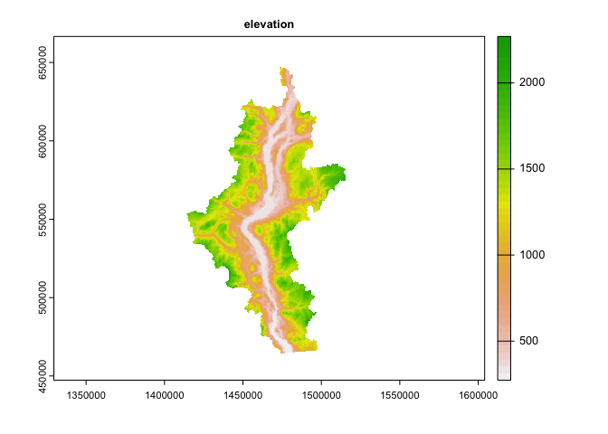
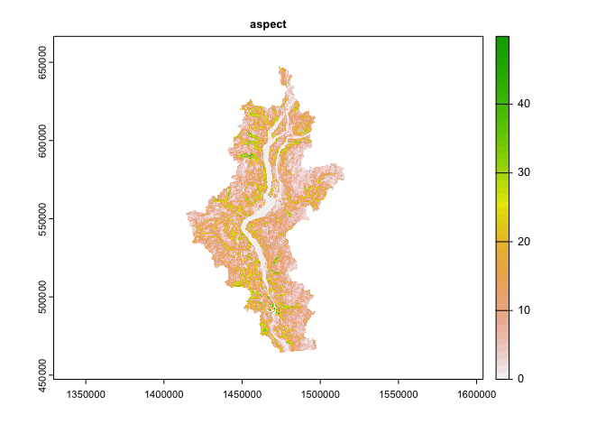
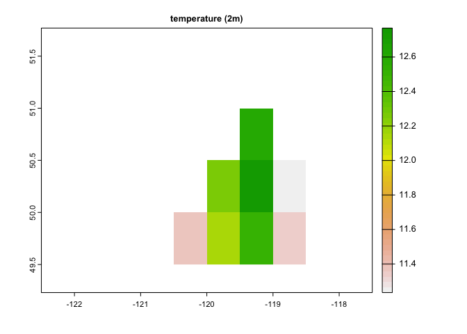
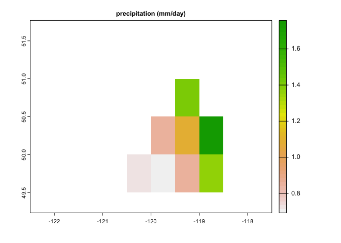
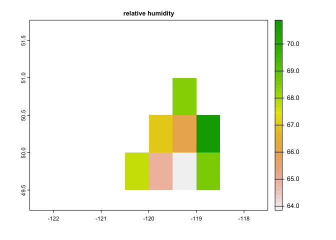
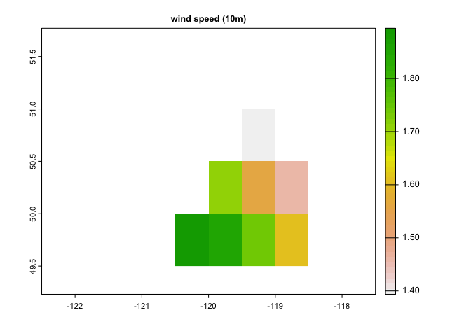
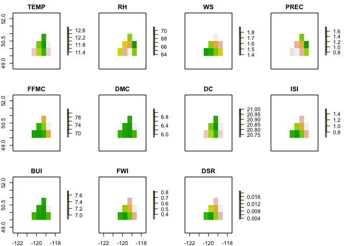

# Wildfire-Mapping-CFFDRS-2.0 Prototype
================
## CabinGIS 
### Proof of Concept:

(SEE LATEST RESULTS HERE: https://github.com/seamusrobertmurphy/Wildfire-Fuel-Mapping-CFFDRS-2.0/blob/main/01_Wildfire-Fuel-Mapping-CFFDRS-2.0_prototype.pdf)
24/02/2022

-   [Action](#action)
-   [1 BC WildFire Fuel Typing and
    VRI-Layer Classification
    Algorithm](#bc-wildfire-fuel-typing-and-vri-layer-classification-algorithm)
    -   [1.1 Import Site Data](#import-site-data)
    -   [1.2 Import Topographical Data](#import-topographical-data)
    -   [1.3 Import Climate Data](#import-climate-data)
    -   [1.4 Derive CFFDRS Wildfire Weather
        Rasters](#derive-cffdrs-wildfire-weather-rasters)
-   [2 Import VRI Data](#import-vri-data)

## Action

Building on the momentum and ideas of our last meeting, the following
pipeline was attempted to produce the wildfire fuel mapping outputs
described in the NRC grant “High-Resolution Mapping”:

-   NRC Grant: <https://www.ic.gc.ca/eic/site/101.nsf/eng/00157.html>

Using the new [cffdrs
R-package](https://cran.r-project.org/web/packages/cffdrs/cffdrs.pdf)
(Wang et al. (2017); Van Wagner and Pickett (1985); Van Wagner (1987)),
we developed rasters of forest fuel moisture code and wildfire weather
indices (Table 1) that were used to fit the stand-adjusted fine-fuel
model (Wotton and Beverly (2007)) applied to vegetation rasters
classified according to 16 fuel classes of the BC forest fuel typing
algorithm ( Perrakis, Eade, and Hicks (2018)). REeult rasters were then
used to fit the Canadian Forest Fire Behaviour Prediction model from
which we drafted raster maps representing Head Fire Index (HFI) and Fire
Intensity maps (FI) (Figure 1) for the Okanagan Watershed Basin for the
day of June 30th 2021.

# 1 BC WildFire Fuel Typing and VRI-Layer Classification Algorithm

## 1.1 Import Site Data

We applied the Okanagan Watershed boundary (FWA ID:212) as our area of
interest, which was downloaded from the BC Geographic Warehouse. We
tested potential base mapping services from [Google Cloud
API](https://cloud.google.com/maps-platform/) and the ggmap package with
a free personal account key token. Four basemaps were derived at a zoom
setting of 9 at the latitude and longitude location of (-119, 50.0).
Likely that Google Cloud services are working off EPSG 3857, though this
needs confirming. With the default ‘statellite’ basemap, we used Lobo’s
script
[(2014)](https://rstudio-pubs-static.s3.amazonaws.com/16660_7d1ab1b355344578bbacb0747fd485c8.html)
to transform the RGB raster to a matrix object and a SpatRaster before
applying different mapping styles. Note that chunk outputs require
substantial system memory and may cause crashes.

``` r
gmap1 = ggmap(get_map(location = c(-119.7, 50.0), maptype = "satellite", source = "google", zoom = 9))
gmap2 = ggmap(get_map(location = c(-119.7, 50.0), maptype = "toner-lite", zoom = 9))
gmap3 = ggmap(get_map(location = c(-119.7, 50.0), maptype = "toner-background", zoom = 9))
gmap4 = ggmap(get_map(location = c(-119.7, 50.0), mqptype="terrain-labels", zoom = 9))
```

``` r
mgmap <- as.matrix(gmap)
vgmap <- as.vector(mgmap)
vgmaprgb <- col2rgb(vgmap)
gmapr <- matrix(vgmaprgb[1, ], ncol = ncol(mgmap), nrow = nrow(mgmap))
gmapg <- matrix(vgmaprgb[2, ], ncol = ncol(mgmap), nrow = nrow(mgmap))
gmapb <- matrix(vgmaprgb[3, ], ncol = ncol(mgmap), nrow = nrow(mgmap))
rgmaprgb <- brick(raster(gmapr), raster(gmapg), raster(gmapb))
rm(gmapr, gmapg, gmapb)
rgmaprgbGM <- rgmaprgb
raster::projection(rgmaprgbGM) <- CRS("+init=epsg:3857")
extent(rgmaprgbGM) <- unlist(attr(gmap, which = "bb"))[c(2, 4, 1, 3)]
unlist(attr(gmap, which = "bb"))[c(2, 4, 1, 3)]
rprobextSpDF <- as(extent(unlist(attr(gmap, which = "bb"))[c(2, 4, 1, 3)]), "SpatialPolygons")
raster::projection(rprobextSpDF) <- CRS("+init=epsg:4326")
rprobextGM <- spTransform(rprobextSpDF, CRS("+init=epsg:3857"))
extent(rgmaprgbGM) <- c(rprobextGM@bbox[1, ], rprobextGM@bbox[2, ])
rgmaprgbGM_disksafe = writeRaster(rgmaprgbGM, file = "rgmaprgbGM", format = "GTiff", overwrite = TRUE, datatype = "INT1U")
xcenter <- (extent(rgmaprgbGM)@xmax + extent(rgmaprgbGM)@xmin)/2
ycenter <- (extent(rgmaprgbGM)@ymax + extent(rgmaprgbGM)@ymin)/2
height <- extent(rgmaprgbGM)@xmax - extent(rgmaprgbGM)@xmin
width <- extent(rgmaprgbGM)@ymax - extent(rgmaprgbGM)@ymin
```

The Okanagan Watershed boundary was extracted from British Columbia
Freshwater Atlas Dataset and processed as a simple feature reprojected
to the EPSG:3857 coordinate reference system match the Google Cloud
Mapping API.

``` r
watershed_okanagan = st_read("./Data/watershed-okanagan-QX.shp")
```

    ## Reading layer `watershed-okanagan-QX' from data source 
    ##   `/Volumes/128GB_WORKD/EFI-FIRE/01_Wildfire-Mapping-CFFDRS-2.0_prototype/Data/watershed-okanagan-QX.shp' 
    ##   using driver `ESRI Shapefile'
    ## Simple feature collection with 1 feature and 6 fields
    ## Geometry type: POLYGON
    ## Dimension:     XY
    ## Bounding box:  xmin: 1413784 ymin: 464311.2 xmax: 1515562 ymax: 647056.5
    ## Projected CRS: NAD83(CSRS) / BC Albers

``` r
ggplot(watershed_okanagan) + geom_sf(alpha=0.1) + coord_sf()
```

<!-- -->

## 1.2 Import Topographical Data

LiDAR data of 3-arc second resolution was acquired using the ‘elevatr’
package and the continuing Mapzen license (Van Zyl (2001)). DEM data was
transformed into a spatRaster and disaggreated from 98m resolution fown
to 32m\~ resolution. Slope and aspect rasters were calculated using the
terra::terrain function with a bilinear interpolation and a rook
neighbourhood sampling of 8 adjacent cells. This produced problematic
results and the raster processing approach was oapplied using the
deprecated slopeAspect functions.

``` r
ELV = get_elev_raster(watershed_okanagan, z=9)
#raster::projection(ELV) <- CRS("+init=epsg:3857")
GS = slopeAspect(ELV, filename = "./Data/GS.tif", out='aspect', unit='degrees', neighbors=8, overwrite=TRUE)  
GS = raster("./Data/GS.tif")
GS = rast(GS)
Aspect = slopeAspect(ELV, filename = "./Data/Aspect.tif", out='slope', unit='degrees', neighbors=8, overwrite=TRUE)  
Aspect = raster("./Data/Aspect.tif")
Aspect = rast(Aspect)
ELV = rast(ELV)
ELV = disagg(ELV, fact=3.3)
GS = resample(GS, ELV, method="bilinear")
Aspect = resample(Aspect, ELV, method="bilinear")
Aspect = mask(Aspect, vect(watershed_okanagan))
GS = mask(GS, vect(watershed_okanagan))
ELV = mask(ELV, vect(watershed_okanagan))
plot(GS, main='slope')
plot(ELV, main='elevation')
plot(Aspect, main='aspect')
```



## 1.3 Import Climate Data

Climate variables were downloaded as NetCDF files from NASA Power
platform and read directly into R as rasters of 1) mean daily
temperature at 2m, 2) mean daily precipitation, 3) mean relative
humidity, 4) and mean wind speed at 10m. The NASA Power platform
supports some very user-friendly API links for static data sources that
might be useful for this proposed grant project. REminder tho, some
API’s prefer dealing with dataframe inputs so might be worht preparing
df pipe while still fresh in the head.

-   NASA Power Platform:
    <https://power.larc.nasa.gov/data-access-viewer/>

``` r
temp = terra::rast("./Data/temp.nc")
prec = terra::rast("./Data/prec.nc")
rh = terra::rast("./Data/rh.nc")
ws = terra::rast("./Data/ws.nc")
temp = mask(temp, vect(watershed_okanagan))
prec = mask(prec, vect(watershed_okanagan))
rh = mask(rh, vect(watershed_okanagan))
ws = mask(ws, vect(watershed_okanagan))
temp = mean(temp)
prec = mean(prec)
rh = mean(rh)
ws = mean(ws)
names(temp) = 'temp'
names(prec) = 'prec'
names(rh) = 'rh'
names(ws) = 'ws'
plot(temp, main='temperature (2m)')
plot(prec, main='precipitation (mm/day)')
plot(rh, main='relative humidity')
plot(ws, main='wind speed (10m)')
#temp = terra::resample(temp, ELV, method="bilinear")
#prec = terra::resample(prec, ELV, method="bilinear")
#rh = terra::resample(rh, ELV, method="bilinear")
#ws = terra::resample(ws, ELV, method="bilinear")
```



## 1.4 Derive CFFDRS Wildfire Weather Rasters

Interpolated climate predictors were assembled as a raster stack and
inputted into the fwiRaster function. The ’out=“all’” option was
selectedin the fwiRaster function which gave us the additional raster
outputs for Initial Spread Index (isi), and Build-up Index (bui).

``` r
temp = raster::raster(temp)
prec = raster::raster(prec)
rh = raster::raster(rh)
ws = raster::raster(ws)
stack = stack(temp, rh, ws, prec)
names(stack)
```

    ## [1] "temp" "rh"   "ws"   "prec"

``` r
fwi_outputs = fwiRaster(stack, out = "all")
plot(fwi_outputs)
```

<!-- -->

``` r
ffmc = raster(fwi_outputs, layer=5)
dmc = raster(fwi_outputs, layer=6)
dc = raster(fwi_outputs, layer=7)
isi = raster(fwi_outputs, layer=8)
bui = raster(fwi_outputs, layer=9)
fwi = raster(fwi_outputs, layer=10)
dsr = raster(fwi_outputs, layer=11)
```

# 2 Import VRI Data

The VRI dataset was downloaded from imapBC as a shapefile.shp and
transformed into simple feature for processing oeprations using sf and
dplyr functions. For CFFDRS data requirements, we consulted the two
package-provied sample datasets ‘test_fwi’ and ‘test_fpb’ presented
below:

``` r
library(cffdrs)
print(as_tibble(test_fwi), n = 10)
```

    ## # A tibble: 48 × 9
    ##     long   lat    yr   mon   day  temp    rh    ws  prec
    ##    <int> <int> <int> <int> <int> <dbl> <int> <int> <dbl>
    ##  1  -100    40  1985     4    13  17      42    25   0  
    ##  2  -100    40  1985     4    14  20      21    25   2.4
    ##  3  -100    40  1985     4    15   8.5    40    17   0  
    ##  4  -100    40  1985     4    16   6.5    25     6   0  
    ##  5  -100    40  1985     4    17  13      34    24   0  
    ##  6  -100    40  1985     4    18   6      40    22   0.4
    ##  7  -100    40  1985     4    19   5.5    52     6   0  
    ##  8  -100    40  1985     4    20   8.5    46    16   0  
    ##  9  -100    40  1985     4    21   9.5    54    20   0  
    ## 10  -100    40  1985     4    22   7      93    14   9  
    ## # … with 38 more rows

``` r
print(as_tibble(test_fbp), n = 10)
```

    ## # A tibble: 20 × 24
    ##       id FuelType   LAT  LONG   ELV  FFMC   BUI    WS    WD    GS    Dj    D0
    ##    <int> <fct>    <int> <int> <int> <dbl> <int> <dbl> <int> <int> <int> <int>
    ##  1     1 C-1         55   110    NA  90     130  20       0    15   182    NA
    ##  2     2 C2          50    90    NA  97     119  20.4     0    75   121    NA
    ##  3     3 C-3         55   110    NA  95      30  50       0     0   182    NA
    ##  4     4 C-4         55   105   200  85      82   0      NA    75   182    NA
    ##  5     5 c5          55   105    NA  88      56   3.4     0    23   152   145
    ##  6     6 C-6         55   105    NA  94      56  25       0    10   152   132
    ##  7     7 C-7         50   125    NA  88.8    15  22.1   270    15   152    NA
    ##  8     8 D-1         45   100    NA  98     100  50     270    35   152    NA
    ##  9     9 M-1         47    85    NA  90      40  15.5   180    25   182    NA
    ## 10    10 M-2         63   120   100  97     150  41     180    50   213    NA
    ## # … with 10 more rows, and 12 more variables: hr <dbl>, PC <int>, PDF <int>,
    ## #   GFL <dbl>, cc <int>, theta <int>, Accel <int>, Aspect <int>, BUIEff <int>,
    ## #   CBH <lgl>, CFL <lgl>, ISI <int>

Wotton and Beverly’s model of stand-adjusted fine fuel moisture content
requires five predictor variables, two of which were extracted directly
from spatial layers of the the VRI dataset including stand-type
(‘SPEC_CD_1 ==?’ & ’SPEC_PCT_1 \> 0.80)

``` r
vri2020_sf = st_read("./Data/BCGW_7113060B_1645786298548_3276/VEG_COMP_LYR_R1_POLY/VEG_R1_PLY_polygon.shp")
st_crs(watershed_okanagan) = 3005
vri2020_sf = st_intersection(st_make_valid(vri2020_sf), watershed_okanagan)
stand = vri_sf["SPEC_CD_1"] %>% mutate(SPEC_CD_1 = as.factor(SPEC_CD_1))
stand = rename(stand, stand = SPEC_CD_1)
summary.factor(stand$stand)

vri2020_sf %>% select(name, SPEC_CD_1) %>% mutate(
  C1 = SPEC_CD_1 = 'S')

vri_species_aoi$species_class = dplyr::recode(vri_species_aoi$SPEC_CD_1, 
             PL = 0, PLI = 0, SB = 1, SE = 1, SX = 1, FD = 2, FDI = 2,CW = 3, HW = 4, BL = 5)

density = vri_sf["LIVE_STEMS"] %>% mutate(LIVE_STEMS = as.numeric(LIVE_STEMS))
density = rename(density, density = LIVE_STEMS)
ggplot(stand) + geom_sf(aes(fill=stand), size = 0.05)
ggplot(density) + geom_sf(aes(fill=density), size = 0.0005) + scale_fill_viridis_c()
vri2020_sf$SPEC_PCT_1
#M1_fuel_mixedwood80 = vri2020_sf$
```

``` r
stand = vri_sf["SPEC_CD_1"] %>% mutate(SPEC_CD_1 = as.factor(SPEC_CD_1))


raster::crs(watershed_bcimap) = "EPSG:3005"
plot(watershed_bcimap)
watershed_bcimap$Export


plot(st_geometry(vri_sf))
plot(st_geometry(cutblk_sf))
fields::stats(vri_sf) 
fields::stats(cutblk_sf) 

fields::stats(vri_sf$HRVSTDT) 
fields::stats(vri_sf$C_I_CODE) 
fields::stats(vri_sf$BEC_ZONE) 
fields::stats(vri_sf$BCLCS_LV_1)

C1_fuel = vri_sf %>% 
  dplyr::filter(BCLCS_LV_2 == 'V', BCLCS_LV_1 == 'V', 
                HRVSTDT > 19970000 | HRVSTDT > 20140000 | HRVSTDT == NA, 
                BEC_ZONE == "BWBS" \| BEC_ZONE == "SWB", 
                SPEC_CD_1 =='S' | SPEC_CD_1 == 'SB' | SPEC_CD_1 == 'SE' | SPEC_CD_1 =='SX')

M1_fuel = vri_sf %>% d

C2_fuel = vri_sf %>% dplyr::filter(BCLCS_LV_2 == 'V', BCLCS_LV_1 == 'V', HRVSTDT \> 19970000, HRVSTDT \> 20140000, BEC_ZONE == "BWBS" \| BEC_ZONE == "SWB", SPEC_CD_1 =='S' \| SPEC_CD_1 == 'SB' \| SPEC_CD_1 == 'SE' \| SPEC_CD_1 =='SX')

C3_fuel = vri_sf %>% dplyr::filter(BCLCS_LV_2 == 'V', BCLCS_LV_1 == 'V', HRVSTDT \> 19970000, HRVSTDT \> 20140000, SPEC_CD_1 =='Pl' \| SPEC_CD_1 == 'Pli' \| SPEC_CD_1 == 'Plc' \| SPEC_CD_1 =='Pj'\| SPEC_CD_1 == 'P' \| SPEC_CD_1 =='SE',)

C4_fuel = vri_sf %>% dplyr::filter(BCLCS_LV_2 == 'V', BCLCS_LV_1 == 'V', HRVSTDT \> 19970000, HRVSTDT \> 20140000, SPEC_CD_1 =='Pl' \| SPEC_CD_1 == 'Pli' \| SPEC_CD_1 == 'Plc' \| SPEC_CD_1 =='Pj'\| SPEC_CD_1 == 'P' \| SPEC_CD_1 =='SE',)

C4_fuel = vri_sf %>% dplyr::filter(BCLCS_LV_2 == 'V', BCLCS_LV_1 == 'V', HRVSTDT \> 19970000, HRVSTDT \> 20140000, SPEC_CD_1 =='Pl' \| SPEC_CD_1 == 'Pli' \| SPEC_CD_1 == 'Plc' \| SPEC_CD_1 =='Pj'\| SPEC_CD_1 == 'P', vri_sf\$PROJ_AGE_1 \< 2) \# Competitor Tools for Fuel Typing in BC 2022

#### *fwiRaster and sdmc calculated based on daily climate records*

#### *gfmc and hffmc calculated based on hourly climate records - key to CFFDRSv2.0*

#### *Start date of fire season calculated with fireSeason*

#### *All outputs generated for once-daily calcuylations for the full fireSeason chronologically using 'batch=TRUE' function*
```

<div id="refs" class="references csl-bib-body hanging-indent">

<div id="ref-perrakis2018british" class="csl-entry">

Perrakis, Daniel DB, George Eade, and Dana Hicks. 2018. *British
Columbia Wildfire Fuel Typing and Fuel Type Layer Description*. Canadian
Forest Service, Natural Resources Canada.

</div>

<div id="ref-van1987development" class="csl-entry">

Van Wagner, CE. 1987. “Development and Structure of the Canadian Forest
Fire Weather Index System. Canadian Forestry Service Forestry.”
Technical Report 35, Ottawa.

</div>

<div id="ref-van1985equations" class="csl-entry">

Van Wagner, CE, and TL Pickett. 1985. *Equations and FORTRAN Program for
the Canadian Forest Fire Weather Index System*. Vol. 33.

</div>

<div id="ref-van2001shuttle" class="csl-entry">

Van Zyl, Jakob J. 2001. “The Shuttle Radar Topography Mission (SRTM): A
Breakthrough in Remote Sensing of Topography.” *Acta Astronautica* 48
(5-12): 559–65.

</div>

<div id="ref-wang2017cffdrs" class="csl-entry">

Wang, Xianli, B Mike Wotton, Alan S Cantin, Marc-André Parisien, Kerry
Anderson, Brett Moore, and Mike D Flannigan. 2017. “Cffdrs: An r Package
for the Canadian Forest Fire Danger Rating System.” *Ecological
Processes* 6 (1): 1–11.

</div>

<div id="ref-wotton2007stand" class="csl-entry">

Wotton, B Mike, and Jennifer L Beverly. 2007. “Stand-Specific Litter
Moisture Content Calibrations for the Canadian Fine Fuel Moisture Code.”
*International Journal of Wildland Fire* 16 (4): 463–72.

</div>

</div>
